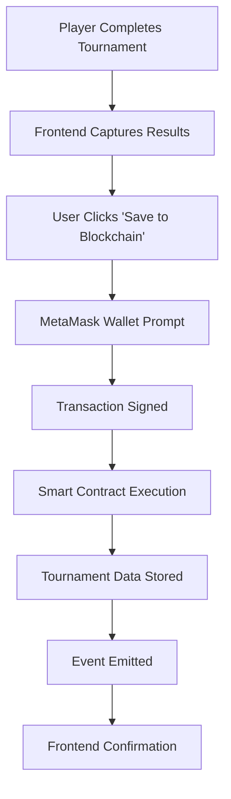

# 🏓 Pong on Blockchain

A decentralized gaming platform that combines classic Pong gameplay with blockchain technology to create immutable tournament records. Players can compete in tournaments and permanently store their results on the blockchain.

## 📋 Project Overview

**Pong on Blockchain** is a full-stack web application that demonstrates the integration of traditional gaming with Web3 technologies. The project features real-time multiplayer Pong games, tournament management, and blockchain-based result storage, creating a transparent and tamper-proof gaming ecosystem.

### 🎮 Key Features

- **Real-time Multiplayer Pong**: WebSocket-based gameplay with smooth controls
- **Tournament System**: 4-player tournament brackets with ranking
- **Blockchain Integration**: Permanent storage of tournament results
- **Web3 Wallet Integration**: MetaMask support for blockchain interactions
- **User Management**: Authentication and profile system
- **Responsive Design**: Modern UI with space-themed aesthetics

## 🔗 Blockchain Architecture

### Smart Contract Details

The heart of the blockchain integration is the `TournamentDetails` smart contract deployed on a local Ethereum network.

**Contract Location**: `blockchain/pong-blockchain/contracts/TournamentScores.sol`

```solidity
contract TournamentDetails {
    struct Player {
        string name;
        uint256 score;
        uint256 rank;
    }

    struct Tournament {
        string name;
        Player[] players;
        uint256 timestamp;
    }

    Tournament[] public tournaments;
    
    function addTournament(
        string memory name,
        string[4] memory playerNames, 
        uint256[4] memory playerScores, 
        uint256[4] memory playerRanks
    ) public { ... }
    
    function getTournaments() public view returns (Tournament[] memory) { ... }
}
```

### 🛠 Blockchain Technology Stack

| Component | Technology | Version |
|-----------|------------|---------|
| Smart Contract Framework | Hardhat | 2.22.17 |
| Solidity Version | Solidity | ^0.8.0 |
| Web3 Library | ethers.js | 5.7.2 |
| Frontend Integration | Web3.js | 1.6.1 |
| Testing Framework | Mocha + Chai | Latest |
| Network | Local Ethereum | localhost:8545 |

### 📡 Blockchain Integration Flow



### 🔧 Smart Contract Features

#### **Data Structure**
- **Tournament Records**: Immutable storage of tournament results
- **Player Information**: Names, scores, and rankings
- **Timestamps**: Blockchain-verified tournament completion times
- **Event Logging**: Tournament addition events for frontend listening

#### **Core Functions**
1. **`addTournament()`**: Stores tournament results with 4 players
2. **`getTournaments()`**: Retrieves all stored tournament records
3. **`TournamentAdded` Event**: Emitted when new tournaments are added

### 🌐 Web3 Integration

The frontend seamlessly integrates with the blockchain through:

**MetaMask Connection**:
```javascript
// Initialize Web3 connection
if (typeof window.ethereum !== 'undefined') {
    web3 = new Web3(window.ethereum);
    const accounts = await window.ethereum.request({ 
        method: 'eth_requestAccounts' 
    });
    contract = new web3.eth.Contract(abi, contractAddress);
}
```

**Tournament Submission**:
```javascript
// Submit tournament to blockchain
await contract.methods.addTournament(
    tournamentName,
    playerNames,
    playerScores,
    playerRanks
).send({ from: account });
```

## 🏗 Architecture Overview

### System Components

```
┌─────────────────┐    ┌─────────────────┐    ┌─────────────────┐
│   Frontend      │    │   Backend       │    │   Blockchain    │
│   (React/JS)    │◄──►│   (Django)      │    │   (Hardhat)     │
│                 │    │                 │    │                 │
│ • Game UI       │    │ • User Auth     │    │ • Smart Contract│
│ • Web3 Integration    │ • WebSockets    │    │ • Tournament    │
│ • MetaMask      │    │ • REST API      │    │   Storage       │
└─────────────────┘    └─────────────────┘    └─────────────────┘
         │                       │                       │
         └───────────────────────┼───────────────────────┘
                                 │
                    ┌─────────────────┐
                    │   PostgreSQL    │
                    │   Database      │
                    └─────────────────┘
```

### 🐳 Docker Configuration

The project uses Docker Compose for easy deployment:

- **Frontend** (Port 3000): Nginx-served React application
- **Backend** (Django): REST API and WebSocket server
- **Blockchain** (Port 8545): Hardhat local Ethereum node
- **Database** (PostgreSQL): User and game data storage
- **Game Services**: Dedicated Pong and TicTacToe containers

## 🚀 Quick Start

### Prerequisites
- Docker & Docker Compose
- MetaMask browser extension
- Node.js (for development)

### Installation & Setup

1. **Clone the repository**:
```bash
git clone https://github.com/Himejjad/pong_on_blockchain.git
cd pong_on_blockchain
```

2. **Start all services**:
```bash
make up
# or
docker-compose up --build -d
```

3. **Configure MetaMask**:
   - Network: Localhost 8545
   - Chain ID: 31337
   - Add the deployed contract address (check console logs)

4. **Access the application**:
   - Frontend: https://localhost:3000
   - Blockchain RPC: http://localhost:8545

### 🎯 Blockchain Deployment Process

The blockchain component automatically:

1. **Compiles** the smart contract using Hardhat
2. **Starts** a local Ethereum node on port 8545
3. **Deploys** the TournamentDetails contract
4. **Provides** contract address for frontend integration

**Deployment Script**: `blockchain/pong-blockchain/init_hardhat.sh`

## 🎮 How to Play & Use Blockchain Features

1. **Connect Wallet**: Click "Connect Wallet" and approve MetaMask connection
2. **Join Tournament**: Participate in 4-player tournament brackets
3. **Complete Games**: Play through tournament matches
4. **Save Results**: Click "Save to Blockchain" after tournament completion
5. **Verify Storage**: Check tournament records stored permanently on blockchain

## 🔍 Blockchain Verification

### View Tournament Records

You can interact with the smart contract directly:

```javascript
// Get all tournaments from blockchain
const tournaments = await contract.methods.getTournaments().call();
console.log('Stored tournaments:', tournaments);
```

### Contract Interaction Interface

The project includes a standalone HTML interface (`blockchain/pong-blockchain/scripts/index.html`) for direct contract interaction:

- Add tournaments manually
- View all stored records
- Filter and search tournaments
- Verify blockchain data integrity

## 🛡 Security & Decentralization

### Blockchain Benefits
- **Immutable Records**: Tournament results cannot be altered
- **Transparency**: All data publicly verifiable on blockchain
- **Decentralized Storage**: No single point of failure
- **Cryptographic Security**: Protected by Ethereum's consensus mechanism

### Current Limitations
- **Local Network**: Currently runs on localhost (development)
- **Gas Costs**: No gas optimization implemented
- **Fixed Structure**: Limited to 4-player tournaments
- **Centralized Elements**: User authentication still on traditional backend

## 📊 Technical Details

### Smart Contract Gas Usage
- **Deployment**: ~500,000 gas
- **Add Tournament**: ~150,000 gas per transaction
- **Get Tournaments**: Read-only (no gas cost)

### Frontend Integration Files
- `frontend/app/pong/js/submitTournament.js`: Blockchain submission logic
- `frontend/app/pong/js/bracket.js`: Tournament UI integration
- `frontend/app/page/game-page.js`: Wallet connection handling

## 🔧 Development & Testing

### Local Development
```bash
# Start blockchain node
cd blockchain/pong-blockchain
npx hardhat node

# Deploy contract
npx hardhat run scripts/deploy.js --network localhost

# Run tests (when available)
npm test
```

### Contract Verification
```bash
# Compile contract
npx hardhat compile

# Verify deployment
npx hardhat verify --network localhost <CONTRACT_ADDRESS>
```


## 🙏 Acknowledgments

- Built as part of the ft_transcendence curriculum project
- Demonstrates practical Web3 integration with traditional gaming
- Showcases blockchain technology for gaming transparency

---

**Note**: This project is currently configured for development use. For production deployment, additional security measures, gas optimization, and mainnet configuration would be required.
